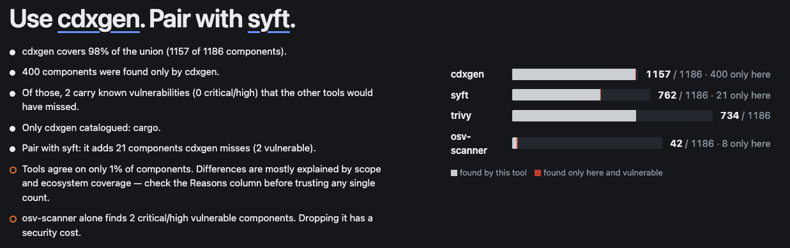
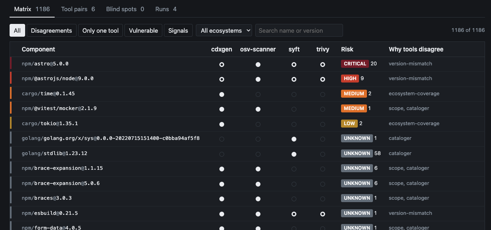

# sbomcmp

Run every SBOM generator you have, compare what they found, explain where they disagree, weight the disagreements with vulnerability data, and get a recommendation you can defend.

```
$ sbomcmp scan ./my-repo

[syft]    ok: 164 components (cyclonedx-1.6) in 2.1s
[cdxgen]  ok: 171 components (cyclonedx-1.6) in 6.4s
[trivy]   ok:  98 components (cyclonedx-1.7) in 1.3s
union 180 components across 3 tools
found 3 MCP server reference(s) — not covered by any generator
enriching with vulnerability data (osv)…
vuln: osv — 41 queried, 6 with findings

Recommendation: cdxgen + syft
  • cdxgen covers 95% of the union (171 of 180 components).
  • 12 components were found only by cdxgen.
  • Of those, 3 carry known vulnerabilities (1 critical/high) that the other tools would have missed.
  • Pair with syft: it adds 7 components cdxgen misses.
  ⚠ 3 MCP server(s) are configured in this project. No SBOM generator lists them — this is a shared blind spot.
```

Then `sbomcmp ui` opens the matrix in your browser, and `sbomcmp report` prints Markdown for a PR comment.





The verdict panel states the recommendation and the evidence behind it. The matrix shows every component, which tools found it (a hollow dot means that tool reported a different version), the highest known severity, and a one-word reason for each disagreement. Filters narrow it to disagreements, single-tool findings, vulnerable rows or registry signals.

## Why

Different generators produce different SBOMs for the same code, and that is not a bug. They read different inputs (manifest vs lockfile vs filesystem), apply different scope policies (dev, optional, transitive), cover different ecosystems, and emit identifiers in slightly different shapes. Today, deciding which tool to standardize on means running them by hand and eyeballing counts.

sbomcmp automates the comparison and, more importantly, the explanation. "cdxgen found 38 more" is trivia. "Of those 38, three have known CVEs and one is critical" is a decision.

## Install

```sh
go install github.com/junseok-seo/sbomcmp@latest
```

`go install` puts the binary in `$(go env GOPATH)/bin` (usually `~/go/bin`). If `sbomcmp` is not found afterwards, that directory is not on your `PATH`:

```sh
echo 'export PATH="$HOME/go/bin:$PATH"' >> ~/.zshrc && source ~/.zshrc
```

Or download a binary from [Releases](https://github.com/junseok-seo/sbomcmp/releases) and put it somewhere on your `PATH`:

```sh
curl -sSfL https://github.com/junseok-seo/sbomcmp/releases/latest/download/sbomcmp_darwin_arm64 -o /usr/local/bin/sbomcmp && chmod +x /usr/local/bin/sbomcmp
```

(Pick `linux_amd64`, `linux_arm64`, `darwin_amd64`, `darwin_arm64` or `windows_amd64.exe`.) Or clone and `make build` (Go 1.24+). There are no runtime dependencies beyond the generators themselves.

Install whichever generators you want compared; sbomcmp detects them on `PATH` and skips the rest:

| Generator | Install | Notes |
|---|---|---|
| [syft](https://github.com/anchore/syft) | `brew install syft` | strongest on container images and OS packages |
| [cdxgen](https://github.com/CycloneDX/cdxgen) | `npm i -g @cyclonedx/cdxgen` | widest language coverage, resolves transitives |
| [trivy](https://github.com/aquasecurity/trivy) | `brew install trivy` | needs lockfiles for most language ecosystems |
| [osv-scanner](https://github.com/google/osv-scanner) | `brew install osv-scanner` | OSV-Scalibr front end |

`sbomcmp generators` lists the adapters built in.

## Usage

```sh
sbomcmp scan ./repo                       # source tree
sbomcmp scan image:nginx:1.27             # container image
sbomcmp scan --only syft,cdxgen ./repo    # subset
sbomcmp scan --ui ./repo                  # open the viewer when done

sbomcmp ui                                # viewer for ./sbomcmp.json
sbomcmp report --format md                # Markdown (PR comments, CI logs)
sbomcmp report --format json              # the full result
```

Output: `sbomcmp.json` (the comparison) and `sbomcmp.raw/<tool>.cdx.json` (each tool's untouched SBOM, so nothing is lost).

### Vulnerability weighting

Disagreement rows (components not every tool found) are checked against a vulnerability database so the recommendation can say which tool's extra findings actually matter. Components every tool agrees on are not sent unless you pass `--vuln-all`. Offline or blocked? The scan still completes, and the recommendation notes that scores reflect coverage only.

| `--vuln-source` | What happens |
|---|---|
| `auto` (default) | `vdb` when `VDB_API_KEY` is set, otherwise `osv` |
| `osv` | [OSV](https://osv.dev) batch query plus per-advisory details (CVSS v3 scored locally). No account needed. `--osv-api` points at any OSV-compatible server. |
| `vdb` | [VDB](https://vdb.ai.kr) `check-packages`: advisories with KEV/EPSS, plus the signals below. Works without a key on a small quota. |
| `none` | skip enrichment (`--no-vuln`) |

```sh
sbomcmp scan --no-vuln ./repo                        # skip entirely
sbomcmp scan --vuln-all ./repo                       # query every component
sbomcmp scan --osv-api https://osv.example/ ./repo   # any OSV-compatible server
sbomcmp scan --vuln-fixture fixtures.json ./repo     # offline fixture (tests, demos)
```

### VDB (optional)

[VDB](https://vdb.ai.kr) is an OSV-compatible vulnerability database that also tracks what CVE feeds do not: package names that do not exist on their registry (slopsquatting), an MCP server registry with trust tiers and declared scopes, and AI model artifacts. sbomcmp uses it as an **optional adapter**:

```sh
sbomcmp scan --vuln-source vdb ./repo    # try it: 5 packages per request, hourly quota, no account
export VDB_API_KEY=vdb_…                 # free key removes the limits; auto-selects vdb
sbomcmp scan ./repo
```

With VDB active:

- Rows whose name **does not exist on the registry** get a `slopsquat` signal. That turns "found only by tool A" into "tool A copied a hallucinated dependency out of the manifest".
- Discovered MCP servers get a **Registry** column: trust tier, scopes, risk score, and recent scope changes. Servers VDB has never seen are marked unverified.
- Advisories carry **KEV** and **EPSS** so a critical nobody exploits ranks below a medium that is being exploited. The viewer sorts by KEV, then EPSS, then severity when VDB data is present, and the report's "Disagreements that matter" table gains an EPSS column.

Coverage is always visible: the status strip under the verdict (and the `Vulnerability data:` line in the report) says which source answered, keyed or anonymous, how many of the queried rows got an answer, and what VDB added (KEV rows, rows with EPSS ≥ 10%, slopsquat signals, MCP registry hits). When the anonymous quota runs out mid-scan the strip turns amber and shows the fix; the same shortfall appears as a recommendation caveat. OSV runs that hit the per-advisory detail cap report how many advisories were left at UNKNOWN.

Without a key, sbomcmp behaves exactly as before against public OSV. `VDB_API_URL` or `--vdb-api` points at a self-hosted deployment.

### MCP blind spot

No SBOM generator lists MCP servers, although they are code the agent runs. sbomcmp reads `.mcp.json`, `.cursor/mcp.json`, `.vscode/mcp.json`, `claude_desktop_config.json`, `.claude/settings*.json` and similar, derives the package each launcher runs (`npx -y @scope/pkg` → `pkg:npm/%40scope/pkg`, `uvx pkg` → `pkg:pypi/pkg`), and reports local heuristics: unpinned packages, broad permission flags, plain-HTTP remotes. With VDB, those packages are checked against its MCP registry.

## How the comparison works

1. **Run** every available generator in parallel, each asked for CycloneDX JSON (SPDX accepted as fallback).
2. **Normalize** each component to a purl key, collapsing known divergences: Go `v` prefixes, PEP 503 name separators, npm scope encoding (`%40babel` vs `@babel`), deb/rpm epochs, qualifiers and subpaths. Structural nodes (Trivy's per-manifest `application` entries) and version-less entries (the scanned module itself) are dropped and counted.
3. **Build the matrix**: one row per key, one cell per tool. Each row is `all` / `partial` / `single`.
4. **Explain** every disagreement with a heuristic reason, in priority order:
   - `version-mismatch` — the missing tool has the same package at another version
   - `ecosystem-coverage` — the missing tool saw no packages of this type at all
   - `scope` — a tool that found it marks it dev/optional
   - `cataloger` — same ecosystem, different depth (transitive, lockfile vs manifest, vendored)
5. **Weight** disagreement rows by vulnerability severity and non-CVE signals.
6. **Score** each tool: 60 × coverage of the union, up to 25 for unique vulnerable findings (8 per critical/high, 3 per other), up to 15 for ecosystems only it catalogued. The top tool is the primary; the runner-up is suggested as a pair if it adds anything.

The coverage matrix is derived from the run, never hard-coded, so it does not rot as the generators add catalogers.

## CI

[`.github/workflows/sbomcmp.yml`](.github/workflows/sbomcmp.yml) installs the generators, scans on every PR, uploads the raw SBOMs, and posts (or updates) a single PR comment with the report. Copy it into any repository; add `VDB_API_KEY` as a repository secret to switch the vulnerability source to VDB.

## Development

```sh
make test     # gofmt, vet, unit tests (purl normalization, parser, comparison, OSV/VDB clients, MCP discovery)
make demo     # end-to-end with mock generators + offline vuln fixture, no network
```

`testdata/mock-bin/` contains shell scripts named `syft`, `cdxgen`, `trivy` that emit realistic CycloneDX with each tool's known quirks (no lockfile → Trivy finds no npm; Syft keeps `Flask_Login`; cdxgen resolves transitives and marks dev scope). `testdata/fixtures/vulns.json` stands in for OSV/VDB. Together they let the whole pipeline run without installing anything.

### Adding a generator

Add one `Adapter` in [`internal/gen/gen.go`](internal/gen/gen.go): binary names, a version probe, and a function that builds the argv for a directory or image target. If the tool only writes SPDX, that still works.

### Adding a vulnerability source

[`internal/osv`](internal/osv) and [`internal/vdb`](internal/vdb) are the two clients; [`internal/vuln`](internal/vuln) selects between them and maps results onto rows. A new source needs a client that fills `model.Vuln` / `model.Signal` and one more case in `vuln.Enrich`.

## Roadmap

- Drift: compare against the previous scan and comment only on what changed
- Quality score (NTIA / CRA minimum fields) by calling `sbomqs` when present
- Push the chosen tool's SBOM to a watch service (`sbomcmp push`)

## License

[Apache-2.0](LICENSE)
